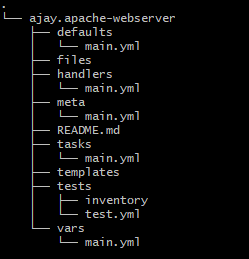
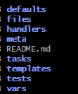

# Configuration and Desired State.

* i want to install nginx and configure it - this comes under configuration 
* i want to make sure this configuration doesn't change - Desired State
* if i want or some one want to change or delete the config file it will auto re-create and maintain desired state..

---
### Configuration Tools Like, for linux OS:-

* puppet 
* chef
* Ansible
* Salt ETC:-


### configuration Tools Like for Windows OS:-

* SCCM
* Powershell DSC
---

## Ansible VS Puppet:-

### Ansible:-
 * no agent needed works on SSH. Free means open source
* not complex 
* it pushes the configuration 
* it works on credentials 
* it is agent less 

## Ansible can use in two ways:-
### Ansible Ad-Hoc Commands 

* #### [Ansible Ad-Hoc Commands Click Here](https://docs.ansible.com/ansible/latest/user_guide/intro_adhoc.html)

###  Ansible Playbooks
* #### [Ansible concepts Click Here](https://docs.ansible.com/ansible/latest/user_guide/basic_concepts.html)


### Puppet:-
* Works on agent base and using puppet agent 
* agent pulls the agent configuration 
* its not free or support 


## [Ansible Documentation Click Here](https://docs.ansible.com/)

## [Ansible Installation Click Here](https://docs.ansible.com/ansible/latest/installation_guide/index.html)

---
- ### Ansible configuration file location - etc/ansible/ansible.cfg
---


* ## [How Ansible will get all the information about client server/instance means, when we run Ansible commands it will connect to client server and it will set the setup module and it will gather all the information to Ansible controller, this is known as Ansible Facts]
---


* ## Use the --verbose/-v flag when running your playbook/ansible ad-hoc to see detailed output from successful modules as well as unsuccessful ones.
---


* ### Ansible Ad-Hoc Basic Command
    
    * ansible -i hosts  -m [module] -a "[module options]"
    * ansible -i hosts -m shell -a "cat/ect/passwd/"
---
* ### Ansible Play-Book Basic Command

     * ansible-playbook -i hosts playbook.yml


 * ## [Ansible CLI cheatsheet Click Here](https://docs.ansible.com/ansible/latest/user_guide/cheatsheet.html)

 * ## [Intro to playbooks Click Here](https://docs.ansible.com/ansible/latest/user_guide/playbooks_intro.html)

---
## Difference between shell script and ansible is:- 
**IDEMPOTENT**

* **IDEMPOTENT means when run playbook for tomcat application, it run execute only once and again if we run it doesn't do anything saying that it is already installed and it will do anything again**

---

* **command or shell is not idempotent (bcoz it execute the raw statement of linux)**

```
Ansible to make idempotent we needs give or select exact statement of module to get ansible as idempotent.
EG:- yum as module in this case yum will install or uninstall it will maintain the desired state..like below EX:-**
if software is present then if we choose the yum install it will check and if it is present it will not do anything that is known as idempotent and desired state
same way reverse if it is not present then yum will uninstall it will remove the software here also it maintain desired state called as idempotent...
```
---

* inventory - means wer we will write information about host/nodes/other servers and we will manage with host.

* ### Two Types of Inventory:-
1. **static** - means we will write all the  information of our own like install any software
 like we will list down all rules by our own.

2. Dynamic - means we write a script or programme which gives us the host we needs to connect all the information through script.

### Default Location Of Inventory File:-
* etc/ansible/hosts
* Usage -i = if we write our inventory or hosts information in Ansible controller apart from default location then we need to pass indention called -i 
* if we create our inventory/hosts information in Ansible controller in default location then not required to pass indention called -i 

---

## Important Keywords In Ansible Playbook:-

* **Debug** - which prints text for the user to see or display message 
* **group_var** - to store groups variables 
* **Host_var** - to store hosts variables
* **Register** - register is a way to capture the output from task execution and store it in a variable
* **When** - is used to condition statement
* **Not** - is used to check the condition is not equal statement !== 
* **Tags** - is used to execute particular or certain black of plays
* **With_Items** - it is loop is used as variables to install multiple software
* **Gather_Facts** - Ansible will collect all the information of other servers like host name, ip address, os information etc..
* **Handlers:-** 
    * running operations on change.
    * Sometimes you want a task to run only when a change is made on a machine
    *  For example, you may want to restart a service if a task updates the configuration of that service, but not if the configuration is unchanged

* **Notify:-** 
       
    * notify keyword can be applied to a task and accepts a list of handler names that are notified on a task change
    * it will will notify when handler task is done
* **ignore_error:-** 
    
    * it is known as error handling
    *  when task failed ansible will not execute rest of the task so mentioning ignore_error ansible can ignore current task and move on to next task

* **Jinja Template:-**

    * it gives value for dynamic files
    * Ansible uses Jinja2 templating to enable dynamic expressions and access to variables and facts
    * jinja template we use to change our applications configuration file
    * like user=admin password=admin or applications configuration content is to change change so then jinja template will be helpful
    * jinja supports for dynamic files or expressions
    * if  our applications file is static means which our applications configuration will not change then no need to use jinja 
    * if our applications configuration is static then we can just use copy or get-url but in our applications some portion is dynamic then 

    * we need to assign in the variable and  to call that variable in file called .j2
    
    * Example :- like this we need to use template in our yml file 

          template:
            src: tomcat7.j2
            dest: /etc/default/tomcat7

    * [jinja template click here](https://docs.ansible.com/ansible/latest/user_guide/playbooks_templating.html) 

* **Vars** - it used to assign the variables in the yml file directley    

* **Include:-**

    * this is used to separate our playbook and task with two different file 
    * For an Examples :-
    * we can mention our all task details or information in the another yml file and just we needs to add the another yml file name in the playbook mentioning include key and value 

* **Serial keyword** 
  
  * This gives you the ability to specify the number of hosts you want to execute against at a time on a per-playbook basis.
  * by using serial keyword we run ansible-playbooks like batch wise 

  example serial keyword:
```
---
- hosts: webservers
  serial:
    - 1
    - 2
    - 25%
    - 50%
  tasks:
    - name: Create Group for Webcontent
      ansible.builtin.group:
        name: webcontent
        state: present
    - name: Create Webcontent Dir
      ansible.builtin.file:
        path: /webcontent
        state: directory
        group: webcontent
        owner: ansible-devops
        mode: '2775' 
```        
---

## Ansible Galaxy:-

* ## what is a roles:-  
  * roles ia a modular way of writing playing book, what this means splitting playbooks into multiple files 

* why bcoz when we start our playbook it was simple then later it is turn to complex means in the playbook file we use many things like (group_var,host_vars,tags,handlers, etc:- many more so to look our playbook file simple. we use roles based playbook so that our playbook file looks simple by splitting into multiple files ..

* when install roles or init roles what are the files generate.

 

  

## ansible galaxy:-  

* Ansible galaxy means sharing of roles or collections of roles, what this means.

* it is like any repository or docker hub repository, so that every one will create different kinds of roles and publish to ansible galaxy.

* incase we want to write some roles, then we install the roles which is available in the ansible galaxy and edit as per our requirements. 

* Roles creation is nothing but creating folder structure 

  * so easiest way to create folder structure is :-
    
    * ansible-galaxy init apache-webserver 
    * ansible-galaxy init <roles_name>  

## To Install Any roles taken from ansible galaxy use this below command:-
 
 * ansible-galaxy install file_name -->> this will install to default location etc/ansible/roles


## To install roles on our own path then use -p and provide where to install/path to install

  * ansible-galaxy install file_name -p

# To Install roles on our own path always then needs to edit below file and set the path

 * ansible-cfg

## If we want to publish our roles to ansible galaxy then we need to use below like username/company_name and image name

* eg:- ajay.apache-webserver ---> we should create roles like this...

## To execute our roles/playbooks in other machine like ansible nodes parallel or at a time follow below option  

 * - F --- Fore-Key execute parallel 
 * Ansible's parallel processes are known as forks,and the default number of forks is 5 in the ansible-cfg file. 
 * You can change the default number of forks for every execution you do by editing the ansible.cfg file. 
 * You can also change the number of forks on a per-command basis, either when running an Ansible ad-hoc command or an ansible-playbook command, by using the -f flag. This flag allows you to change the default to a higher or lower value depending on the group you are executing against.
 * Example of -f or fork-key command:-
  
          ansible host -f forks_number -m module -a “arguments”
          
          ansible-playbook -f forks_number playbook.yml

          ansible-playbook -f 10 playbook.yml 
 ---

* **Set_facts** - we will use to set the variables in the yml file directley instead of using in var file

---

## [Types of Top 10 modules click here](https://opensource.com/article/19/9/must-know-ansible-modules) :-

* Debug
* Copy
* APT
* yum
* command
* shell
* DNF
* service
* File
* Line in file
* Git
* Archive
* Cli_command
* git-url 

---

## Ansible Tower:-

* [Ansible Tower User Guide v3.8.6 click here](https://docs.ansible.com/ansible-tower/latest/html/userguide/index.html)
* [Ansible Tower click here](https://docs.ansible.com/ansible/2.4/tower.html)

---


