# Top Commands:-

- **command is used to know the cpu utilization in Linux**
   
       top
```
q   = ‘q‘ to quit window
z   = Highlight Running Process in Top
c   = Press ‘c‘ option in running top command, it will display absolute path of running process.
U   = use top command with ‘u‘ option will display specific User process details
```

* **command to check the load of the system**

       tload
       
       proc load 

      uptime or will show the load

---


# PS Commands:-

```
ps = process status
e = to display all the processes
f = to display full format listing
```

- **How to list all the running java processes**

      ps –ef | grep java  


- **How to check process running with particular users**

            Ps-u username 
    
- **Command to find memory leak**

       ps aux --sort pmem 

- **How to list top ‘5’ cpu utilization processes**

         ps –auxf | sort –nr –k 3 | head –5
         ps u | sort –k 1 –r | head –5

- **How to run a process in the back ground command**
  
              or

* **command to run the process in the background bg command &**

                  jobs &
                  
                  sleep &


        Put  “& “ at the end of the command
        <complete command>  &

- **How to bring the process to fore ground**

           or 

* **command to run the process in the forground fg**

           fg % # --> process id
           
           fg % 1
           
           fg  <pid>

* **command to show our process in tree structure**

         pstree 

---

# LS Commands:-

```
ls -ld Display Directory Information 
ls -lt Order Files Based on Last Modified Time Using	
ls -R Display Files Recursively 
```

- **List all the hidden files in a directory**

	   ls  –a

- **How to list all the files in ling list format**

             ls  –lrt  
          It gives the files and directories list with permissions
          first character ‘–‘ indicates files,  ‘d’  indicates directory


- **Files to display recursively**

          Ls –r

- **What is the use of lsof command**

            lsof 
      stands for list the open files, which will list all the open files in the system
      The open files include network connection, devices and directories


- **Command to get all the same file name**

       ls -l ServiceLayerREST*

      ServiceLayerREST* when we mention * means list of all files with mentioned name


- **Command to list all the log file in the folder**

        ls -lrt *.log


- **Command to check files or folder in human readable formate**

        ls -lah

---

# Netstat Commands:-

       ```
       netstat= network statistics it display both incoming and outgoing
       internet is open pubic space

       intranet is designed to be a private space but it is accessible from the internet  but as a rule


- **To list All Ports both listening and non listening ports**

          netstat -a | more 

- **To list all tcp ports Transmission Control Protocol**

          netstat -at 


- ** To list all udp port**

        netstat -au 

- **Show the statistics for each protocol**

       netstat -s 

- **Find the non supportive Address families in your system**

          netstat --verbose 

 - **Display extended information on the interfaces similar to ifconfig**

           netstat -ie       

- **How to list all the listening ports**

            netstat –a

- **How to know the port number based on process id<PID>**
            
            	netstat  –antp | grep <pid>


- **How to know the processed id <PID> based on port number**

           netstat  –antp | grep <port>

 ---

 # File Permission Commands:-      

- **Permission using with numbers:-**
  - Read -  r=4     
  - Write – w=2
  - execute – x=1   
  - total = 7

  - 1st – current user/owner permission = 7
  - 2nd – group user permission = 7
  - 3rd – other user permission = 7

  - file/folder = 777=R+W+E=Read+Write+Execute.

- **Files/Folders signification of signs:-**

  - ( - ) indicates file
  - ( D ) indicates Directory


- **Permission using with Alphabets :-**

  - (A) or (UGO) - Indicates for all the users like:- (owner/current users),(group users) and (other user)
  - U – indicates owner/current user
  - G – indicates group user 
  - O – indicates other user 
  - ( - ) - indicates removing the permission 
  - ( + ) - indicates adding the permission


- **EX:- Below are:-**

     - chmod ugo+rwx filename - this means for all the 3 users giving permission of rwx.
     - chmod ugo-rwx - filename this means for all the 3 users removing the permission of rwx.
     - chmod ugo/a=rwx - filename this means for all the 3 users giving permission of rwx.
     - chmod 777 filename - this means for all the 3 users giving permission of rwx
     - chmod 000 filename - this means for all the 3 users removing permission of rwx

---

# DF Commands:-

- **Command to check size,used and available disk space in the filesystem**

          df -h

- **Command to check free disk space**

     df –m <location> or <file_Folder_name> 
     
     1. M - MB
     2. G- GB
     3. K - KB

- **Command to find free memory**

      free -m/-k <location> or <file_Folder_name> 

      1. M - MB
      2. K - KB

- **Command to check particular file or folder disk usage over all** 

         Df -h file name/folder name 
     
---

# Du Commands:-

- **Command to show total memory used in the server file system human readable formate**
 
       du -ahc
       du -sh
       du -ah

- **How to check easiest way 5 high disk usage**

       du -a (/root)path | sort -n -r | head -n 5 


- **Command to check particular file or location is consuming memory usage** 

         ls -la (/root/core) file name
         df -g | grep roothome 
         du -a /usr/WebSphere/ | sort -n -r | head -n 15


 - **Command  to find top 8 files which consumes high disk usage**

              du  –SM  *|sort   –nr | Head  –8
              Here  ‘s’  summarizes all the reports, ‘m’ indicates size in MB

        
- **Command to check disk usage all the files at a time**
 
              Du -sm*
---

# Kill Commands:-

- **What the difference is between kill –3, kill –9 and kill –15**

        1. kill  –3	<PID> --> to generate the Thread dumps

	 2. kill  –9	<PID> --> to kill the process forcibly

       3. kill  –15  <PID> -->  it will wait to kill the process until the child processes  are killed.
---

# CP Commands:-

* **Command to copy file with same time stamp or backup**

        cp -p ajay.xml ajay.xml20200716

        cp -p <file_name> <file_name_date>

* **Command to copy folder/directory**

       cp -r /home/ajay  /tmp/vijay 

       cp -r ajay ajay_20220820

       cp -r <source_folder> <destination_folder>

      -p if we use this option for same time stamp for folder

---
# SCP Commands:-

* **Command to copy files from windows server to linux server**

      scp hello.sh akumar@tpydaltinsl01.sl.bluecloud.ibm.com:/tmp/

      scp <filename> <linux_user_name@<linux_hostname>/<ip_address>:/path/

* **Command to copy files from linux server to window server**

      scp akumar@dpydaldinsl01.sl.bluecloud.ibm.com:/tmp/hello.sh  ./

      scp<linux_user_name@<linux_hostname>/<ip address>:/path/filename (where to download) I use ./ for windows current location)

      scp akumar@dpydaldinsl01.sl.bluecloud.ibm.com:/tmp/hello.sh C:\Users\AVP8TK744\Desktop\

       scp<linux_user_name@<linux_hostname>/<ip address>:/path/filename space (path of the windows server where to download)


* **Command to copy directory from windows to linux server**

      scp -r rajesh akumar@dpydaldinsl01.sl.bluecloud.ibm.com:/tmp/

      scp -r <directory_name><linux_user_name@<linux_ hostname>/<ip_address>:/path/

* **Command to copy directory from linux server to widows server**

       
       scp -r akumar@dpydaldinsl01.sl.bluecloud.ibm.com:/tmp/rajesh ./

       scp -r <directory_name><linux_user_name@<linux_ hostname>/<ip_address>:/path/directory name ./ (./ which used to download directory to current location)

       scp -r akumar@dpydaldinsl01.sl.bluecloud.ibm.com:/tmp/rajesh C:\Users\AVP8TK744\Desktop\

       scp -r <directory_name><linux_user_name@<linux_ hostname>/<ip_address>:/path/directory name space (path of the windows server where to download)

---

# VI Commands:-

* esc :wq--- to save and quit
* esc :x --to save and quit
* shift ZZ to save and quit
* esc :q-- to quit
* esc :! -- quit without saving
* esc gg-- jump to first line of file or esc :0 zero
* esc G-- jump to last line
* x or shift D is to delete current characters
* dd The command dd deletes current line completely.
* esc : u  or u --- this command is used for undo
* . = command allows us to repeat last used command.
* yy= copy the line 
* p = paste
* ctrl e =to scroll the page 
* shift e = jump to each sentence
* w = to check each word
* 3w= to go to 3 word of paragraph
* dw= to delete the each word 
* j ``>`` move cursor to one line down
* k ``>`` move cursor to one line up
* h ``>`` move cursor left to one character
* l ``>`` move cursor right to one character
* 0(zero) ``>`` move the cursor to staring of current line
* $ ``>`` move cursor to end of end of current line
* w ``>`` move cursor to beginning of next word
* b ``>`` move cursor to beginning of previous word
* u ``>`` undo 
* G ``>`` move cursor to end of the File
* 1G ``>`` move cursor the starting of the file
* 3G ``>`` move cursor to the 3rd line of the file.  (nG  ``>`` for nth  line).
* dd ``>`` delete entire line from current cursor position, without blank line.
* cc ``>`` deletes entire line from current cursor position with auto edit of blank line.
* D ``>`` Deletes the right side portion of the cursor position.
* (small oh) ``>`` to insert a blank line below the cursor (current line).
* :q ``>`` after saving only it will quit otherwise it won’t quit from editor
* :set number ``>`` to set number for words or paras in VI
*   Select insert mode then paste right click mouse ``>`` to paste in VI
* Esx:/command words then enter N for next ``>`` to check common words in VI

---

# TAR Commands:-

* C - Create an archive.
* X - Extract files
* V - verbose, print the file names as they are extracted one by one
* Z - The file is a "gzipped" file
* F - Allows you to specify the filename of the archive


* **Command to create a tar file**

      tar -cvf <file_name>

      tar –czvf <file_name>.tar  

* **Command to Extract the tar file

      tar -xvf <file_name>

      tar –xzvf <file_name>.tar

---

# IF Command:-

* **Command to check ip address**

         ifconfig
---

# Nullify, Tail and Logs Commands:-

 * **Command to nullify or Empty the logs or files**

       > <file_name>

       or

       :> filename

       truncate -s 0 filename

       -s is used to set/adjust the size (in bytes) of the file

       When you use -s 0, it means you adjusted the file size to 0 bytes

       echo > filename

       echo "" > filename

       cat /dev/null > file.log


* **Command to tail the log file**

      tail -f <log_file_name>

      tail -1 to any numbers <file_name>

      Tail -fn200 or more filename

* **Command to check Head of the log file**

      Head -1 to 100 any numbers <file_name>


* **Command to check particular words in running logs**

          Tail –f filename|grep space particular word

 * **Command to display the 10th line of file**

       head-10 filename|tail-l

---


# Crontab Commands:-

* **What is the crontab syntax**
    
    * cronjob -l <direct_path><file_name>

* **I want to execute a script, everyday at 5:00pm.
    Write crontab syntax to achieve that**


``min`` ``Hours`` ``day_of_month`` ``month`` ``day_of_week`` ``path_of_script``

    *	   17		*		*		*	<path_of_script>


* **Command to list the cronjobs

       crontab -l

* **Command to Edit Cronjobs

       contab -e

---


# File Commands:-

* **Command to read file**

      cat <file_name>

      more <file_name>

      sed '' <file_name>

* **Command to rename the file**

      mv <old_file_name><new_file_name>

* **Command to move the file from one location to another**

      mv <file_name> <path_of_file>

* **Command to display number of lines in a file**

         wc  -l <file_name>

* **Command to display number of characters in a file**

       wc  -m  <file_name> 
    
* **Command to display number of words in a file**    

       wc  -w  <file_name> 

* **Command to display number of characters, words, bytes, lines in a file**

       wc  <file_name>  

* **Command to find the file or directory**

      find /usr/logs/ -type f -name '*.log' -exec ls -l {} \;

      find /usr/logs/ -type f -name '*.log' -exec chmod 600 {} \;

      find (path) -type f -name -exec ls -l {}\;

* **Command to list all  file or folder name**

      ls -l | egrep 'client.policy|sas.client.props|sas.stdclient.properties

       ls  -l | egrep filename or folder name 

* **Command search a file which is modified older than 10 days**

      Find <file_path> -type f -name  -mtime +10

      Access Time= -atime 
      Change Time= -ctime 
      Modify Time= -mtime

* **Command search a file which is modified older than 10 days and delete that files**

      Find <file_path> -type f -name  -mtime +10 -exec rm –rm


* **command to check largest file**

      Find <file_path> -type f -name –size +1000000 –exec ls-l{}\;


* **command to find the files size more than 100 MB**


       find  <file_path> -type f -name  –size +100M

* **command to find different between two file**

        diff <file_name><file_name>

        Vimdiff <file_name><file_name>

* **Command create multiple files

          touch <file.1><file.2><file.3>

* **Command to check different between two files hash**

        Md5sum <file_name> 

           or 
    
        md5sum <file_name> and <file_name>

---

# Command to check lock/unlock/status of user_id:- 

 ## Two Method Linux:-

### Oberviation :-
* LK: Password locked 
* NP: No password
* PS: Password set

## This Below Is Linux Method-1 :-

* **Command to  lock user id account  in linux**

      passwd -l akumar

* **command to check user id account status in linux**

      passwd -S akumar or passwd -–status akumar

* **Command to check if user id account already is locked**

      grep akumar /etc/shadow 
  * .. //Two exclamation mark will be added in front of the password, if the account is already locked.


* **Command to unlock the user id acoount**

       passwd -u akumar

## This Below Is Method Linux 2:- 

* **Command to check user id account locked**

      Usermod -L akumar or usermod –lock akumar

* **Command to check user id account status**

      Passwd -S akumar or passwd  --status akumar

* **Command to unlock the user id account**

      Usermod -U akumar or usermod  --unlock akumar

---

# Command to check status of user_id lock/unlock AIX:-

* **Command to check all the user id which is locked **

      lsuser -a account_locked ALL

* **Command to check user id acoount locked**       

        lsuser -a account_ locked akumar

* **command to lock user id acoount**

      chuser account_ locked=true akumar

* **command to unlock user id account**

      chuser account_ locked=false akumar

* **Command to check user id details**      

      Lsuser -f user id

* **Command to check unsuccessful login attempts**

      lsuser -f matmonuc | grep unsuccessful_login_count

* **command to clear or resetting the unsuccessful_login_count**

       chuser unsuccessful_login_count=0 matmonuc

* **command to check last login under user id**

       lsuser -f mrpliwme | grep time_last_login

---

# OS Version Commands:-

* **Command to find the given OS is 32 bit or 64 bit**

       arch 

       Output is i686 is 32 bit 
       x86 is 64 bit 

* **Command to find the os name

      uname


* **Command to find the given os version**

        more   /etc/*release

---

# Zip and Unzip Commands:-

* **Command to Zip the file**

        gzip  <file_name>

* **Command to unzip the file**

         unzip <file_name>

---

# Ping Command:-


* **Command to ping**

        ping <ip_address> or <host_name>

---

# PWD Command:-

* **Command to check present working directory**

            pwd
---

# Wget Command:-

* **Command to download the link from internet or url**

          wget <url> or <path_link>
---

# Server Up Time OR Reboot Commands:-

* **Command to check server last reboot or uptime**

           uptime or last

           last reboot

* **Command to check server required reboot or not**

            needs-restarting-r

* **command to check last 5 reboot entries in    the wtmp log**

      last -5 reboot shutdown root

* **command to check server reboot time Or boot**

           who -b
---

# Users Logged In Commands:-

* **Command to check how many user logged in the server**

         W or who or users  

         who /var/adm/wtmp

* **Command to find which user name is logged in**

          Who am I 

* **Command to find hostname of the system**

         hostname

* **Command to count numbers of user logged in**

           Who -q

* **Command to check which user logged in and their total information**

          lslogins -u

* **command to check current user’s logged in**

         users

* **command to check which user last logged in the system**

          last

---

# History Commands:-

* **To check all commands of history**

            history

            History | head -n 10 or more 

            History | less
---

# CPU Information Command:-

* **Command to get entire cpu details**

        lscpu

---

# NSLOOKUP COMMANDs:-

* What is the use of nslookup command?
   
   * Nslookup command: it will display server name, ip address, and alias information for the given host.

  * EG:- nslookup hostname , looks like below.

  * EG:- [akumar@tpydaltdoc101 ~]$ nslookup tpydaltdoc101

  * Server:         9.0.128.50
  * Address:        9.0.128.50#53
  * Non-authoritative answer:
  * Name:   tpydaltdoc101.sl.bluecloud.ibm.com
           Address: 10.120.187.157
---

# Switching Commands:-

* **Command  to switch to root user**

        sudo su -
        sudo -i 
---

# To Check Path Variable Or In Built Commands:-

* **Commands to check path variable location

           whereis ls
           whereis pwd
           whereis wget
           whereis java
           whereis jenkins
           whereis maven

---

# Environmental Variable/Path Variable in Linux Distributions:

## Two Types Of Environmental Variable:

1. **User Environment Variable**

*  ~./bashrc

   * if any variable or software path exporting in this ~./bashrc file means then only for that user/particular user can access it, not for other users who logging in the that system

   * vi ~./bashrc => normal vi editor we can save
   * export PATH=${PATH}:/opt/apache-maven-3.8.6/bin
         or
   * export PATH=$PATH:/opt/apache-maven-3.8.6/bin 
* after add should run below command
    * source ~./bashrc
*  like above example needs to add to ./bashrc/user env variable           


2. **System Environment Variable**

* /etc/environment

  * if any variable or software path exporting in this /etc/environment file means then all the users can access it, who ever logging in the that system

  * vi /etc/environment => normal vi editor we can save
* 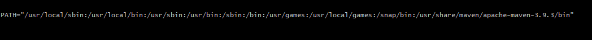
* after add should run below command
    * source /etc/environment
* like above example needs to add to env variable
--- 


* **Command to check all the programs where it is place**

      ehco $PATH

* **Command to check which commandline we are using it**      

        echo $0

---

# Change Java Version in Option:-

* **Command to change java version**

       sudo alternatives --config java

---

# Blocks Comments in Shell Scripts:-

``` 
starting of line /* and end of the line */
```

---

# Blocks Comments in XML Files:-

```<!-- open file and -.- > closing file```

---

# Linux Basic information's or  Commands:-

* **Command to check system defined variables:-

         env

* **Command to check last successful command or not **

            echo $?

* **Command to check which shell we using**

           which $SHELL

* **Command to check what kinds of shell are is available in the os**

          cat /etc/shells


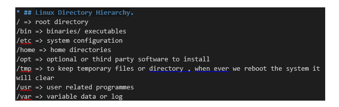

* **command to edit sudoers file**

          visudo => Nano Editor
          To save file CTRL O  AND
          To exit CTRL X 
---

# Directory Commands:-

* **Command create a directory**

         mkdir <directory_name>

* **command to delete the directory**

         rm -rf <directory_name>
---


# Owner Ship Change/ Chown Command:-

* **Command change username owner ship of file**

      chown username:username <file_name>

* **Command change username owner ship of Directory**

      chown -r username:username <directory_name>

* **Command change groupname owner ship of file**

      chown groupname:groupname <file_name>

* **Command change groupname owner ship of directory**

      chown groupname:groupname <directory_name>

---

# New User information's Commands:-


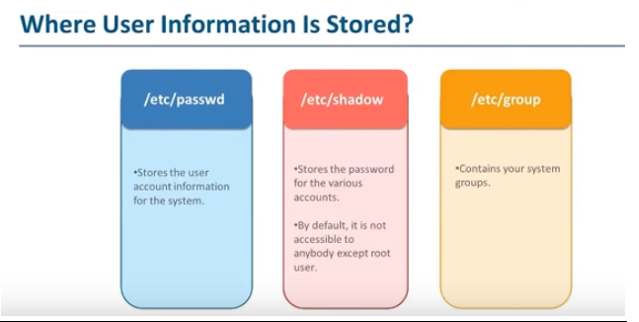

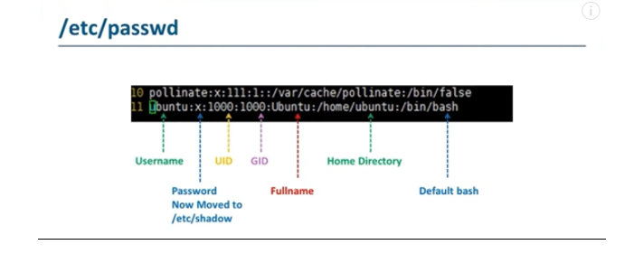 

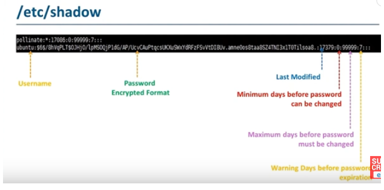 


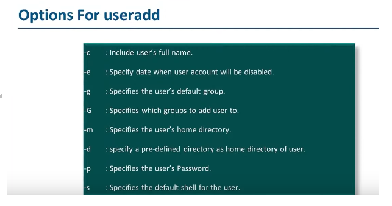


* **Command to add The User_ID in to the server including full name**

      Useradd -c akumarr2@in.ibm.com ajay

* **command to user add in the server**

        useradd ajay
        adduser ajay

* **command to delete the user in the server**

        userdel ajay

* **command to modify the user above screen shot options**

        usermod <options> <username>


* **command to add user to group**

       gpasswd -a ajay ec2-user

       <Group_file_name> -a<user_name><Group_name>

       useradd -G wania akumar

       usermod -a -G wania akumar

       usermod -aG ec2-user ajay

       useradd –G new_group user_name

       usermod –a –G group_name user_name

* **Command to add user id to multiple group**

      usermod –a –G groupname,groupname2,groupname3 user_name

* **Command to remove user id from the group**

      gpasswd -d ajay ec2-user

      gpasswd –d <user_name> <group_name>
       


* **command to add the group**

        groupadd avengers

* **Command to delete the group**

        groupdel <group_name>


# User_ID And Passwd Change Command:-

* **Command to check user expire**

        Chage –l <username> or <user_id>

* **Command to extend the user expire**

           chage -I -1 -m 0 -M 90 -E -1 user id
           chage -d "`date '+%b %d, %Y'`" user id
           chage –l user id
  
* **Command to add Personal Id or Account Expire Date**

      useradd -e YYYY-MM-DD username 

      eg:- useradd -e 2015-11-05 ajay

* **Command to change expire date for user id**

       change -d year month date <user_id>

* **Command to view the user**

        id -u or username

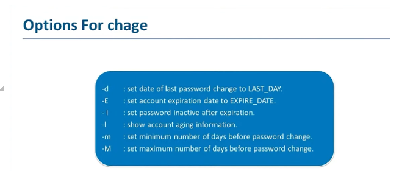

---

# RPM or Package Commands in Linux:-


* **what is RPM.?**

  * RPM is software management system that is used for software installation or uninstallation.

* _Package_:- 

  * consists of archive files,configuration files, binaries

* **command to check the rmp package**

      rpm --q <package_name>

* **command to install the rmp package**

      rpm -i <package_name>

* **command to uninstall the rmp package**

        rpm -e <package_name>

* **Command to check packages installed recently  only 1o packages**

         rpm -qa --last | head -n 10

* **Command to check packages installed everything total packages**         

         rpm -qa -last

* **Command to check packages installed or updated**

        yum check-update

        apt check-update

---

# UMASK Commands:-

* **When we create a new file default Umask is below screen shot**

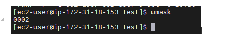

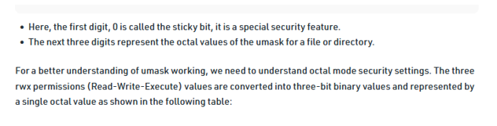

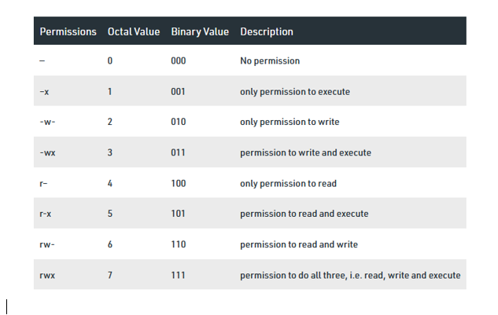

* ## [Refer This Url For Umask](https://www.geeksforgeeks.org/umask-command-in-linux-with-examples/)


* **command to change the user permission on file using umask**

      umask rwx numbers 700

      umask works on octaval and binaries 

* umask is special permission it is used to prevent the files and directories from other users from deleting it

* Sticky bit is special permission it is used to prevent the files and directories from other users from deleting it


* **command to add stick bit**

      chmod +t <file_name> or <directory_name>

---


# Volumes and FileSystems:-

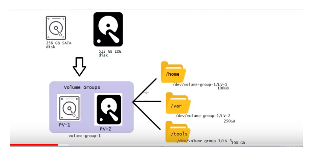


* **command to create physical volume(pv)**

        pvcreate /dev/xvdf
        
        pvcreate  <volume_name>

* **Command to display physical volume**

        pvdisplay

* **command to create volume groups**

       vgcreate vol-1 /dev/xvdf

       vgcreate <volume_name> <path-or-name-of-volume>

* **command to display volume group**

       vgdisplay

* **command to create logical volume(LV)**

       lvcreate -L 512m -n test vol-1

       lvcreate -l <size_of_volume> -n <name_of_LV> <volume_group_name>

* **command to create left over lv from vol-group**

      lvcreate -l 100%free -n test2 vol-1

      lvcreate -l <size_of_volume> -n <name_of_LV> <volume_group_name>         

* **command to display lv**

       lvdisplay

* **command to create directory**

      mkdir extra

* **Command to create  filesystem**

       mkfs -t ext4/xfs/btrfs  /dev/xvdf

      mkfs -t <type_of_filesystem> <volume/hardisk_mount_path_name>

* **Command to mount the filesystem**

      Mount /dev/xvdf   /extra/
      
      Mount <volume/hardisk_mount_path_name> <directory_Name_to_mount>

* **Now lets check created filesystem and mounted to directory**

           df -sh/h

* **Note:-** 
  * after created and mounting the files it will not reflect in the filesystem when we logout and login again because we needs to add in the fstab, details of created filesystem like below:-           

* take backup of /etc/fstab
* cp /etc/fstab /etc/fstab.original

* **lets add or edit the entries to fstab**

        vi /etc/fstab
       UUID= xyz /extra ext4 defaults 00
```
UUID= xyz
diretory to mount = extra
filesystem type = ext4
parameter =
save it
```

```
all the mount filesystem will be stored location or will contain all the mount information 
/etc/fstab
```

* **command to list the block id**

       blkid


* **command to list the block devices**

       lsblk 
---


# Tee COMMAND:-

* **command to read and send or redirect out put like  >**

        or > redirecting to file aj.txt

        ls -al | tee aj.txt

---


# AWK Commands:-

* NR or NF - is to print number of record in the lines
  * NR means number of records in the line like row counting

* print $1,2,3--soo,,onnn. - is the print number of record/field in the lines
   * Print $3 means print the field number 3 means counting number of colomun 


* **Command checked files system**

 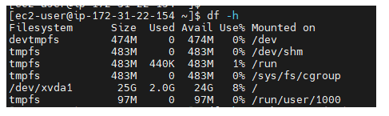

 * **Now by seeing above file system we will use awk command**

 * **Command to use awk to get number of records and fields print in a lines in the file system**

 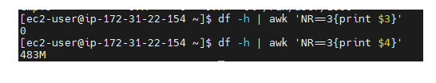

 * **Command checked Docker status**

 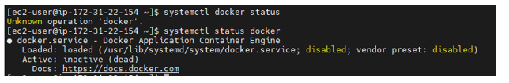

 * **Now by using awk command we will capture few record and fields in the lines with ignoring delimiter**

 * **Command to capture 3rd record in the line and 3rd field in the line with ignoring delimiter**

 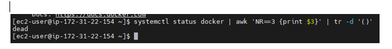

 ---


 # CUT COMMANDS:-

 * **command to check /etc/passwd file**

 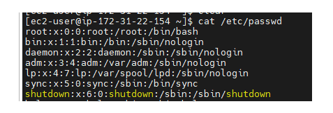


 * **Command using cut in a given file above we can cut 2nd character of the coloumn below both command same**

 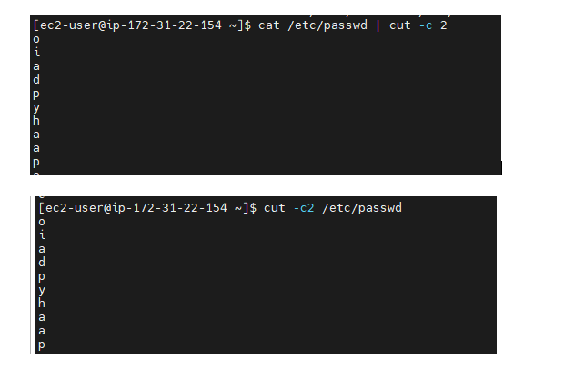


 * **Command to cut range of character below example**

 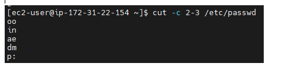


 * **Command to cut postion of character below example**


 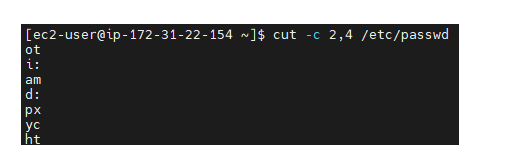

* **Command to get 1st filed in the file by cutting the delimiter, field means column below example**

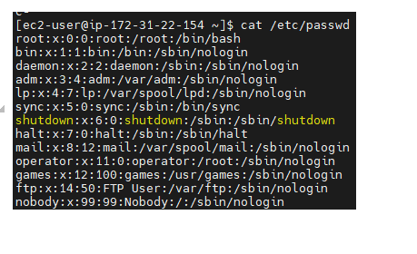

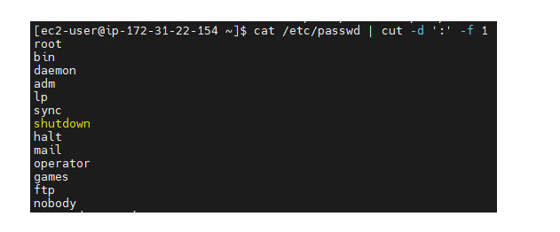


* **
Command to eliminate the filed separator in the file – in the case when mention –s it says that do not print the line/fields which is not containing the delimiter**

          cut -s -d ':' -f 2 /etc/password
---

**Grep Command please look into Shell Script tarainings in github.com/ajaykumarramesh/**

---

# SED COMMANDs:-

### SED COMMANDS ONLY FOR VIEW/PRINT AND DELETE:-

* **Command to open file like cat command in sed**

           Sed "" filename 

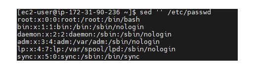

* **Command to print two time of a file in sed**

            Sed ‘p’ filename

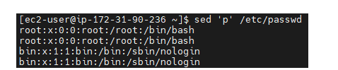

* **Command to avoid printing two times of a file in sed**

           Sed –n ‘p’ filename

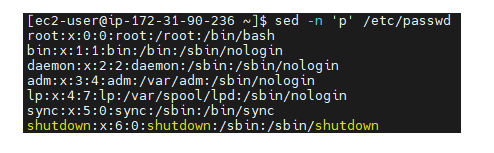

* **Command to print particular line in sed**

       Sed –n ‘3p’ file name > in this case it will print third line in a file

 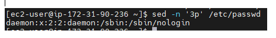

 * **Command to print last line in the file**

         Sed –n ‘$p’ filename

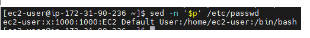

* **Command to print 3rd line to 5th in a file**

       Sed –n ‘3,5p’ filename

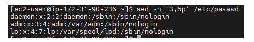

* **Command to print from 12th lines to another adding 7 lines**

          Sed –n ’12,+7p’ file name 


* **Command to delete particular line in a file**

          Sed ‘49d’ filename

* **Command to delete range of from 10th line to 45th line in a file**

        Sed ’10,45d’ filename

* **Command to delete 5th line counting from another 10 lines in a file**

        Sed ‘5+10d’ filename

* **Command to delete the lines permanently in a file**

          Sed –I ‘5d’ filename

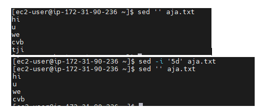

* **Command to take back and delete the lines In a file**

       Sed –i.backup ‘2,5d’ filename

 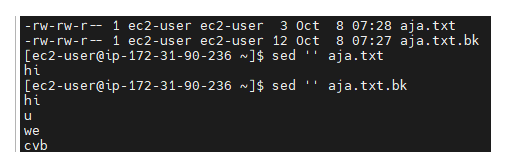

 * **Command to delete 5 lines in a file and after 5th line it will stop deleting**

           Sed –n ’5,$!d’ filename

* **Command not to delete particular word in a file**

       sed  '/h/!d' aja.txt

---

### SED COMMAND TO SEARCH AND PRINT PARTICULAR WORD  IN A LINE:-

* **Command to print particular word in a file**

           Sed –n ‘/root/p’ /etc/passwd

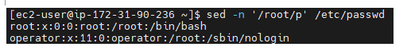

* **Command to print two words in a file**

      Sed –n –e ‘/root/p’ filename    -e  ‘/daemon/p’  filename

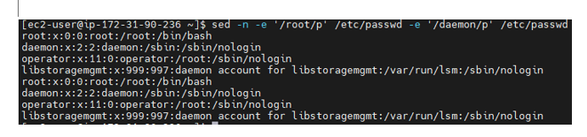

---

### SED COMMAND TO INSERT AND DELETE IN A FILE:-

* **Command to insert some word in a file for the particular line as temporary**

      Sed ‘1abc hi how are you’ filename

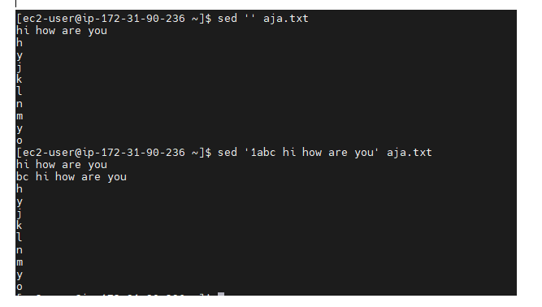

* **Command to insert some word in a file for the particular line as permanently**

         Sed –I ‘1abc hi how are you’ filename

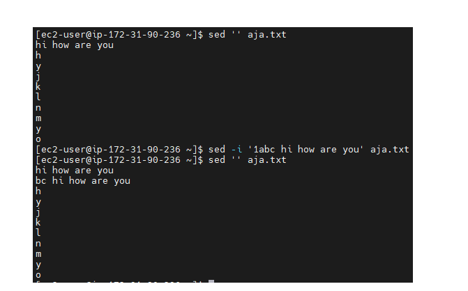

* **Command to insert a word in a file in the last line**

          Sed –I ‘$abc’ filename

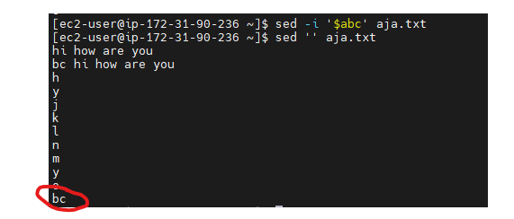

* **Command to insert a word before the existing line**

           sed –I '/bc/i what is ur name' aja.txt

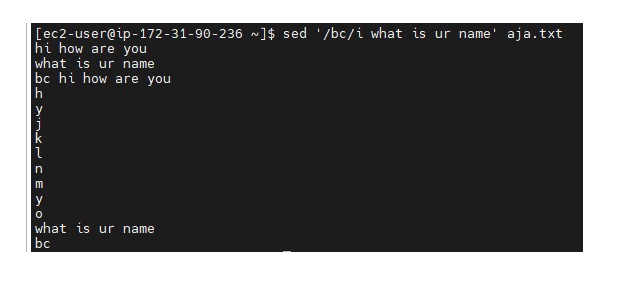

---

### SED COMMAND TO FIND AND REPLACE THE WORD:-

* **Command to replace first word in the file, it will change in every line of a file only first word , which existing words**

        sed 's/root/udemy/' aja.txt

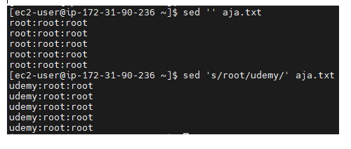

* **Command to replace a word in the files all the line, which is existing words**

      sed 's/root/udemy/g' aja.txt

      sed –i “s/<old string>/<new String>/g”  <filename>

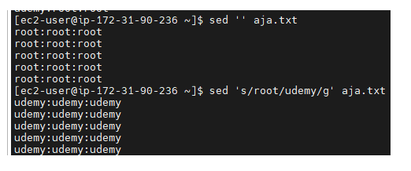

* **Command to replace 2nd word in the file of all the lines which is existing word**

        sed 's/root/udemy/2' aja.txt

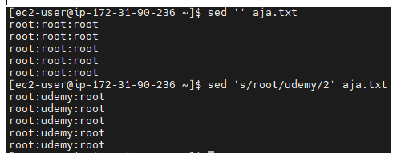

* **Command to replace the particular word with another word in a file, In all the lines which is existing**

       sed '/root/s/root/height/' aja.txt

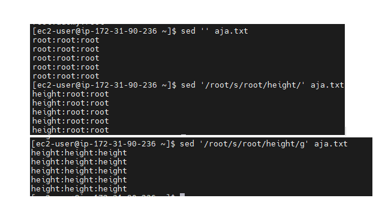

---


# Regex Commands:-

### The special character of in regec are:-

*  \s > \t. *\+ \? and \

* **Command to print two different words in the files**

       sed -n '/p[uo]t/p' hi.txt
       
       sed –n ‘/p[uo]t/p’ filename

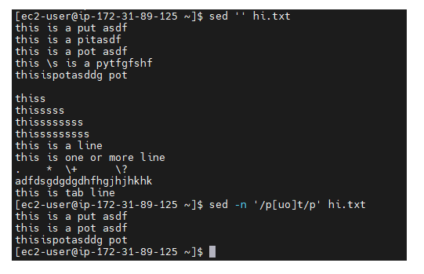

* **Command to print lines which is having space in the file**

      Sed –n ‘/\s/p’ filename

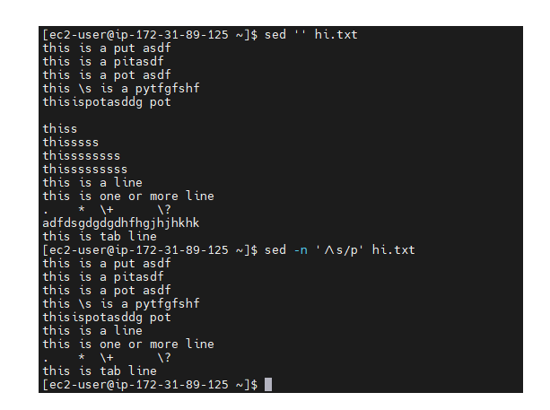

* **Command to print line which is having \s only In the file**

         Sed –n ‘/\\s/p’ filename

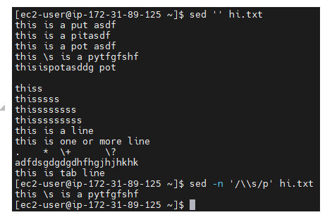

* **Command to print lines which is having tab space**

            sed -n '/\t/p' file name

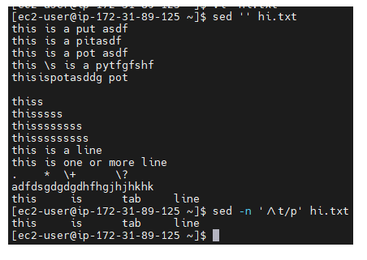

* **Command to print the line between two words in the file**

        Sed –n ‘/p.t/p’ filename


* **Command to print the line which is having some space and print the line between two words**


* **Command to print the lines which having space when starting and ending between word**

         Sed –n ‘/\sp.t\s/p’ filename

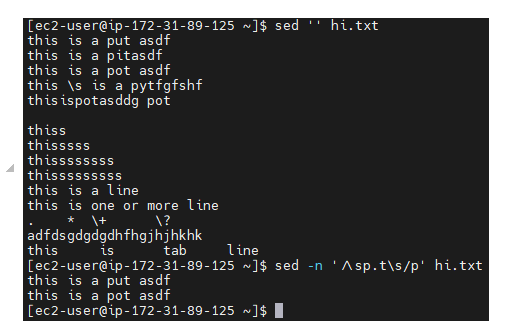

* **Command to print the dot(.) in a line in the given file**

          sed -n '/\./p' hi.txt

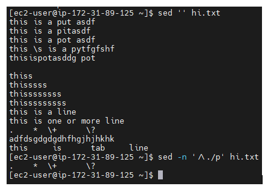

* **Command to print a line with optional of last letter mention (*) command below**

  * Below red marked in the line which doest have s then to it is printed since we mentioned s is optional by using * command 

          Sed –n ‘/this*/p’ filename
          
          sed -n '/this\?/p’ file name
 
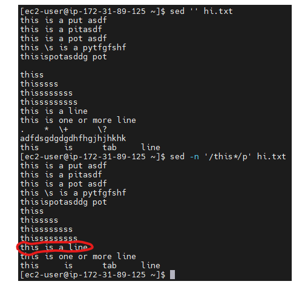

* **Command to print the lines which s should contain alteast one time or more then that but s should be there in the line then only it will print**

       Sed –n ‘/this\+/p’ file name

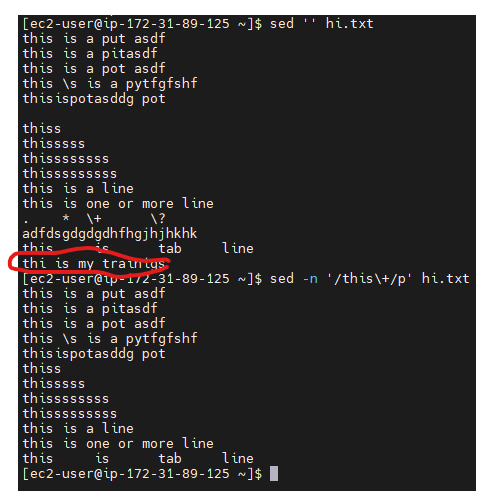

* **Command to print a line with using charact symbol^**

   * ^ symbol means it will print the stating word if matches below 


         sed -n '/^put/p' hi.txt
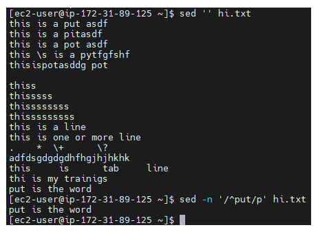

* **Command print the line pot word which is having at the end of the line**

         sed -n '/pot$/p' hi.txt

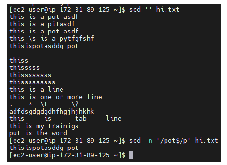

* **Command to print empty lines in a file**

          sed -n '/^$/p' hi.txt

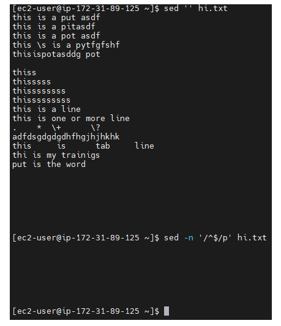

* **Command to delete the empty lines in a file**

          sed -n '/^$/d' hi.txt

          sed -i '/^$/d' hi.txt


* **Command to print charact (^)and dollar symbol ($) in a line given file**

          sed -n '/\^/p' hi.txt
          
          sed -n '/\$/p' hi.txt 


### Command print the line using pattern called [], {} and ():-

 * **Command to print the lines using [] brackets pattern** 

         sed -n '/p[uoy]t/p' hi.txt


* **Command to print the lines using [] brackets pattern range**

       sed -n '/p[a-o]t/p' hi.txt


* **Command to print the lines using {} curly brace pattern**

   * **In the lines to search 3 times of s or more then 3 times which word is having  s  print  that line command below**

         sed -n '/this\{3\}/p' hi.txt

         sed -n '/this\{3,4\}/p' hi.txt  > this is for 3 times or more than that
          
         sed -n '/this\{3,\}/p' hi.txt > n numbers of times infinity 


* **Command to print the lines using () prathensis pattern**

  * **Command to print repeated words in the line of given file**

            sed -n '/\(asdf\)\{2\}/p' hi.txt


---


# Symbolic or SymLink Commands:-

* **What is SoftLink or symlink**

  * SoftLink is link to original file.
  * softlink is pointing or routing to another file 
  * if we delete the original file soft link has no value or file will not work, file which is pointing as softlink file.
  * below is the screen shot which shows in the softlink when we delete original file then softlink dont have any value nor softlink file doesnt contain any data it says no such file or directory.
  * in softlink we can see different file permission for original file and softlink file 

* **Command to create Symlink or SoftLink**

      ln -s <original_file_name><softlink_file_name>

      ln -s hi.txt  softlink.file


---

* **What is HardLink**

   * Hard Link is mirror copy of an original file.
   * if we delete the hardlink file nothing will happen to another file hardlink file, still it has the data of the original file.
   * cannot link the directories  
   * in hardlink same file permission below screen shot
   * if we delete original file still it works in hardlink, still data contain below screen shot

* **Command create hardlink**

        ln <original_file_name><hardlink_file_name>

        ln source.txt hardlink.file


---

* **What is the difference between hardlink and copied file or copy file**

  * when we create hardlink from one source file then if we add more data or content to that source it will automaticlally update the hardlink file too.
  * where as when we copy a noraml file it will not work like this .
  * below screen shot will clear it all doubts

  

---

# Daemon:

* any programs/service which running backround is called daemon

# Command to check users in Linux

* cat /etc/passwd


       


  

