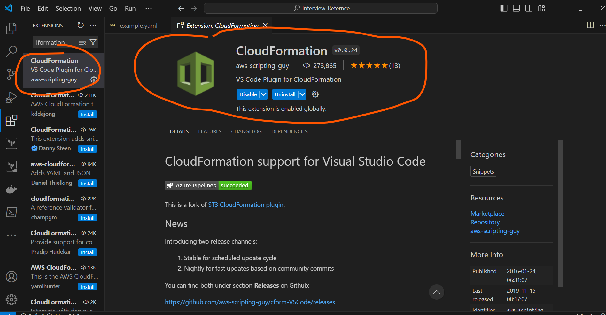

VSCode Extension Details
------------------------
* Needs to install below extension work on particular technologies so that it will support in predefined steps

### Ansible Extension:
* Needs to install below ansible extension to work with ansible predefined steps for yaml files
  * **Note:** when writing ansible yaml file, we needs to select the Language mode to Ansible at the right side bottom of vscode, if not ansible extension will not work.


* When we install this above ansible extension, below extension will automatically will be installed and also with that another few python related extension also will be installed


### Kubernetes Extension:
* Needs to install below k8s extension to work with k8s predefined steps for yaml files
   * **Note:** when writing the k8s yaml file, we needs to select the Language mode to k8s at the right side bottom of vscode, if not k8s extension will not work. and also needs to do below extra step
      * type ctrl+shift+p => then type > `prefrences` > `settings` => then type > `yaml` => then select under `Yaml:Schemas` > `Edit in settings.json` => then add this below content => then both extension file will work means `.yaml/.yml` if not only `.yaml` will for as default so we are changing it. 
       ```
        "yaml.schemas": {

        "Kubernetes": ["/*.yaml","/*.yml"]
        
        },
       ```

* Like below


* Install this below K8s Extension to get entire/complete resources/object yaml files


### Code Spell Checker Extension:
* Install this below extension to check the spelling of the code


### AWS CloudFormation Extension:
* Needs to install aws cloudformation below extension to work with cloudformation template it will give predefined template steps


### Terraform Extension:
* Install terraform extension to work with terraform code as infrastructure to get predefined terraform code


### VScode Extension:
* this below vscode extension for visual studio code design


### Docker Extension:
* Needs to install below docker extension to work with dockerfile predefined steps


### Azure Resource Manager(ARM) Extension:
* Needs to install ARM extension to work with ARM template it will help to get predefined template steps


### Azure Bicep Extension:
* Needs to install azure bicep extension to work with bicep template we will get  predefined template steps


### Azure Cli Tools Extension:
* Needs to install azure cli tool to work with azure cli command


### Azure Powershell Extension:
* Needs to install azure powershell extension to work with powershell commands


### Docker Compose Extension:
* Needs to install docker compose extension to work with docker-compose.yml files it will give us predefined steps


### Jenkins Extension:
* Needs to install Jenkins extension for declarative and scripted pipeline and also other global tools like Jfrog, sonarqube to work with them or to write pipeline code needs to install this extension and it will give us predefined pipeline steps


### Azure Devops Extension:
* Needs to install azure-pipelines extension for azure devops pipelines we will get predefined steps


### These below extension if required then install if not no:
* Azure functions to work with functions service of azure and we can create any functions

* Azure App Services to work with azure app services

* Azure Spring Apps to work with azure spring app services

