## VSCode Extension Details:-

### Needs add all this below extension on VScode when ur working on particular technologies: 


* yaml extension => for all the yaml file includes(k8s,ansible and CI/CD):
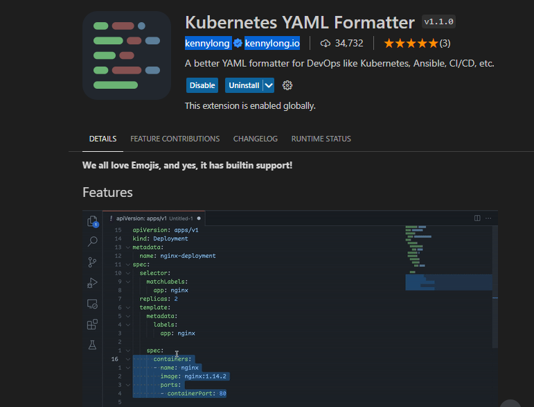
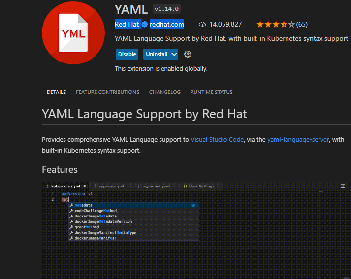 
* K8s above these two extension for helping predefined words while writing the yaml resource for k8s, and also add this below items in settings.json file
```

"yaml.schemas": {
  "Kubernetes": "*.yaml"
}
```
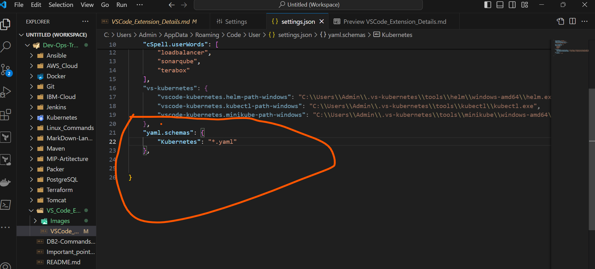
* K8s to get entire/complete resources yaml file install below extension
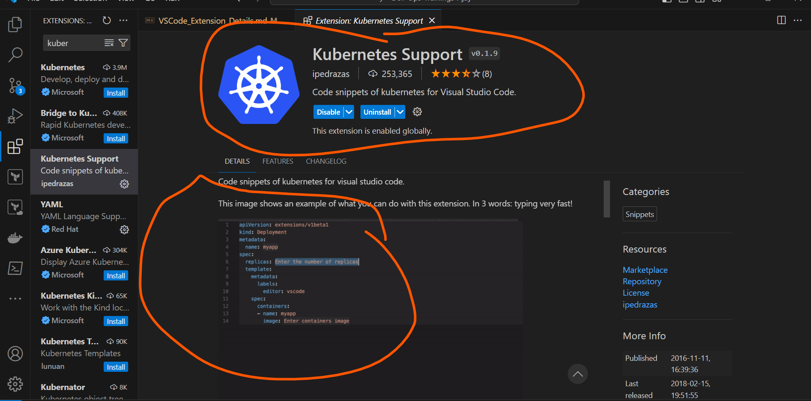
 
* And also below ansible extension only for ansible
* Ansible  
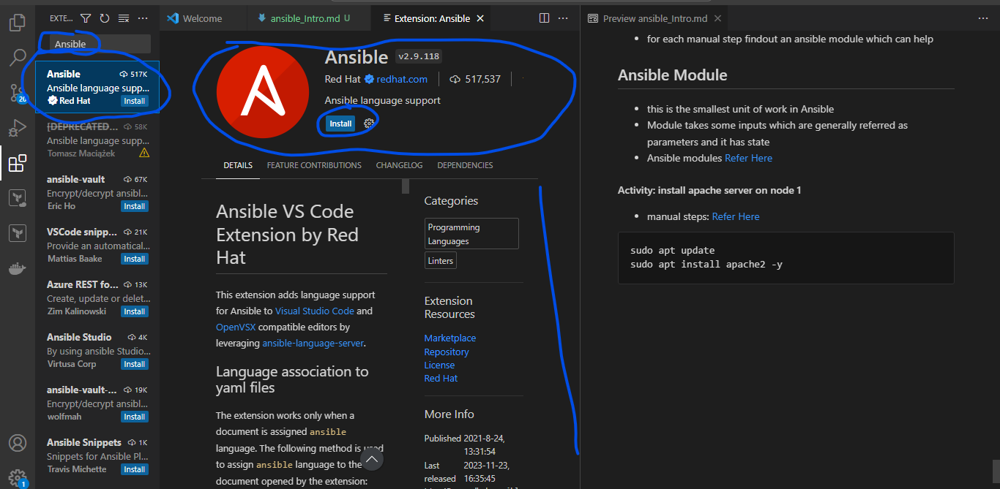

* code spell checker => to check the spelling:
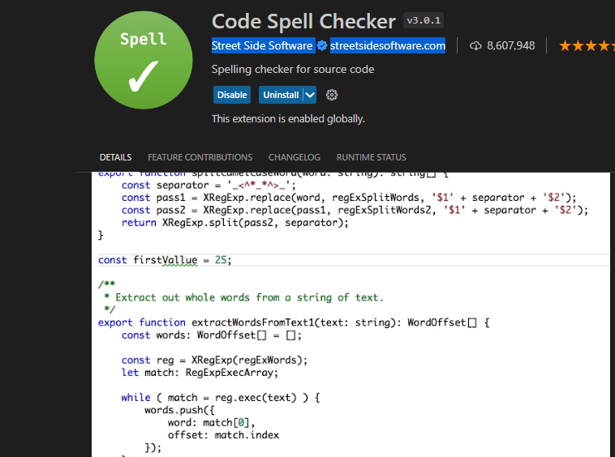

* aws tool kit  - to work aws

* cloudformation - for aws cloudformation 

* bash debug - for debug the shell script

* Terraform approved by hashicorp => for any cloud to deploy infra as code:
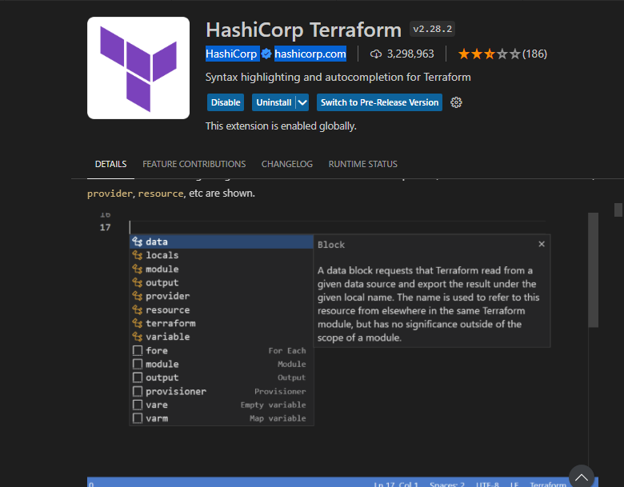

* VScode icon => for visual studio code designs
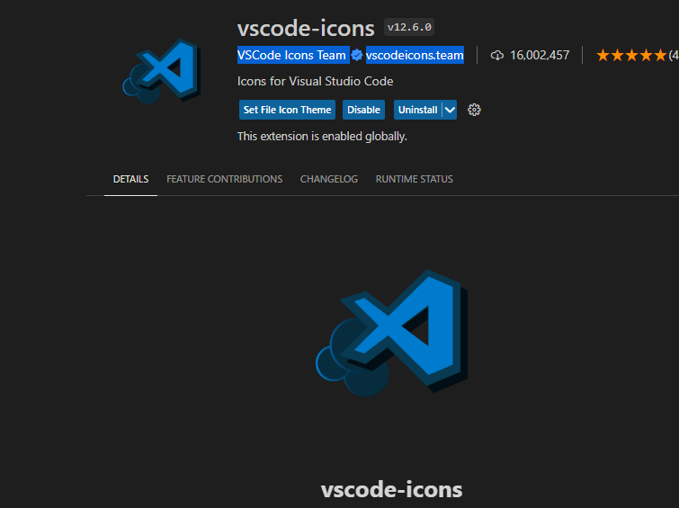

* Docker approved by microsoft => for docker files:
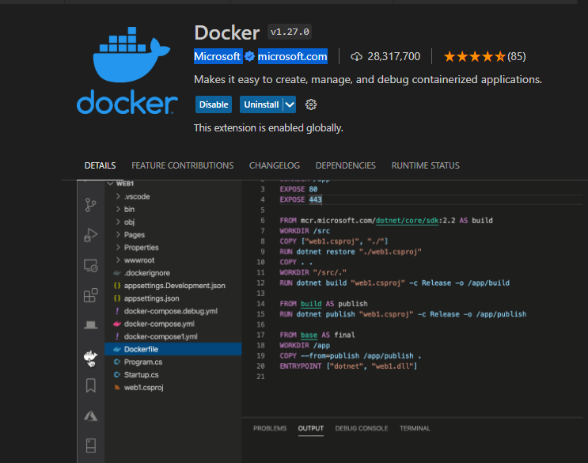

* Azure Devops => Azure Pipelines Approved by Microsoft 
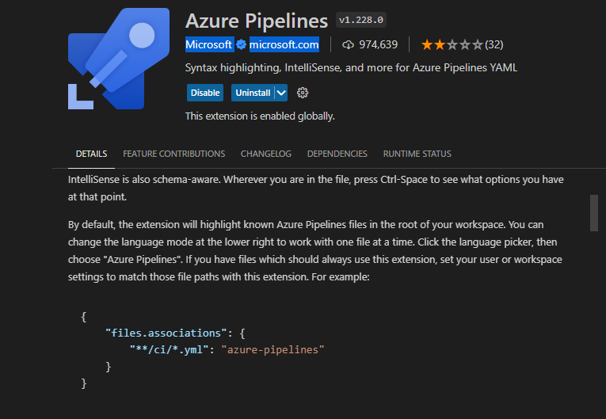
* Azure cloud ARM template to work => Azure Resource Manager 
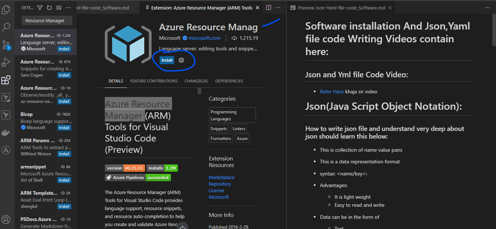

* Azure Cloud Bicep to work => install Bicep
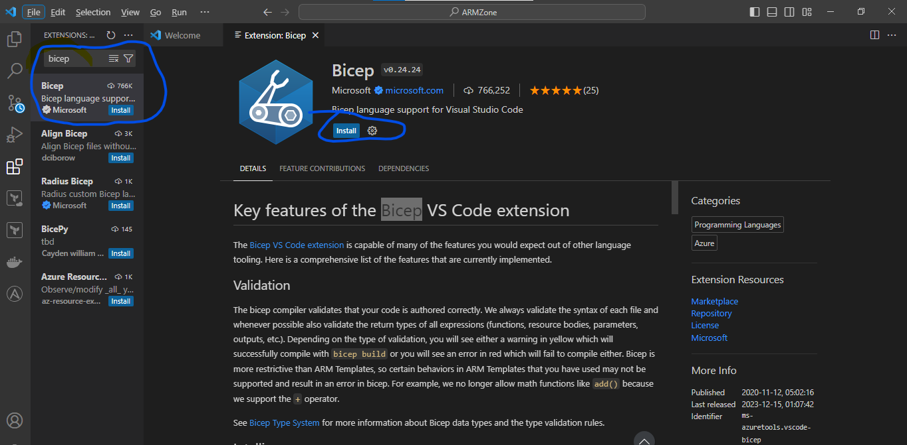

* Azure cli command to work => install Azure CLI Tools
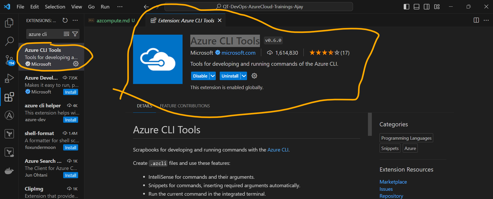

* Azure powershell to work with powershell commands => install PowerShell 
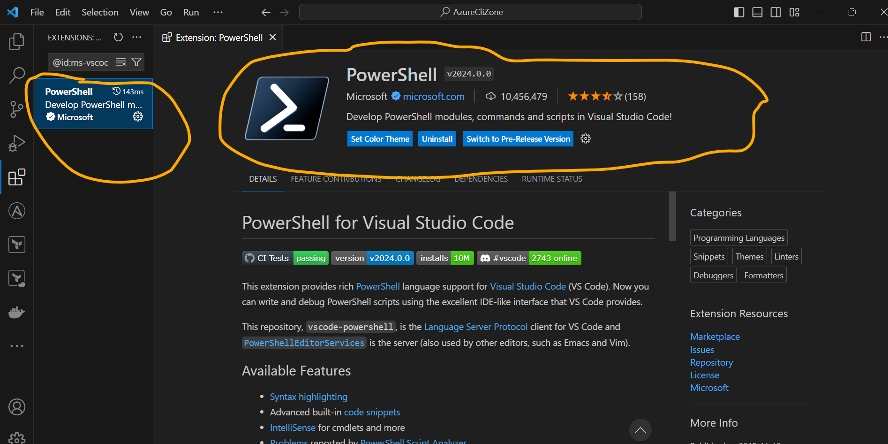

* These below extension if required then install if not no:
    * Azure functions to work with functions service of azure and we can create any functions
    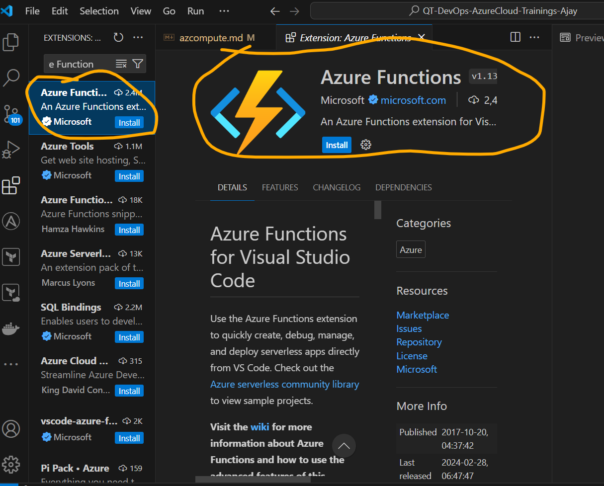
    * Azure App Services to work with azure app services
    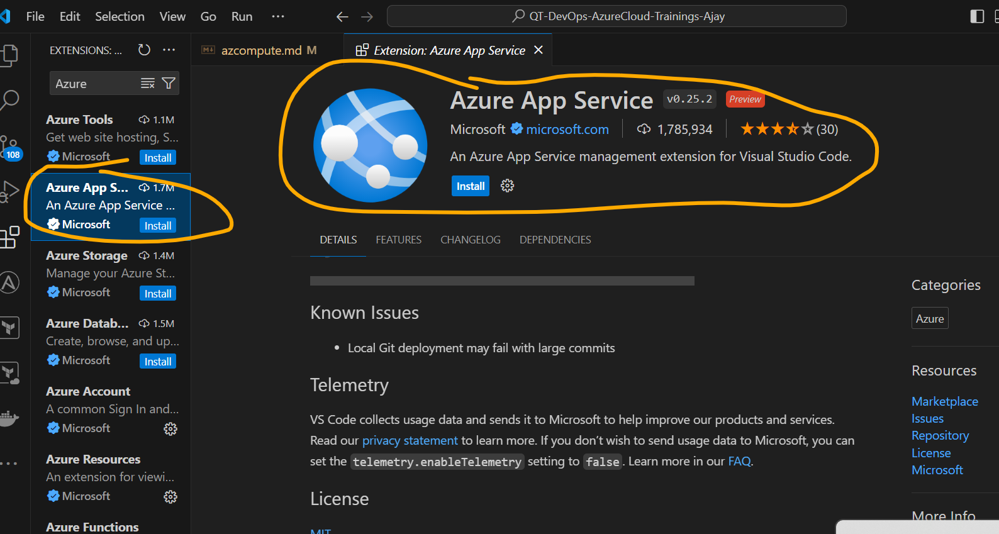
    * Azure Spring Apps to work with azure spring app services
    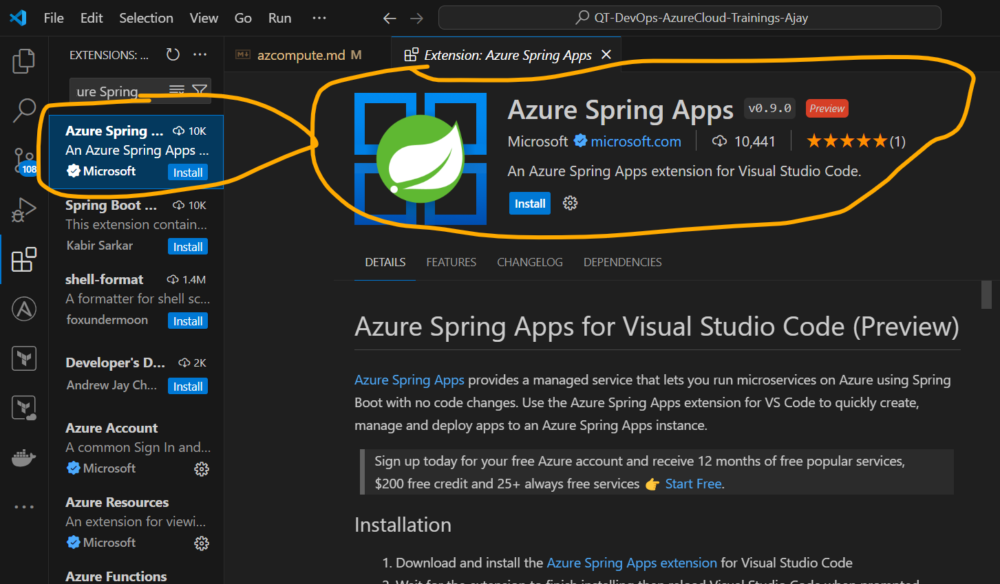

* Docker Compose to work with docker compose yaml files needs to install 
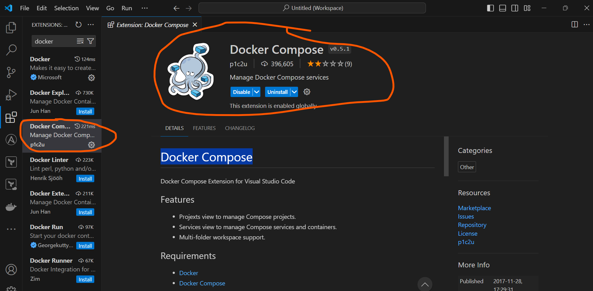

* Jenkins declarative and scripted pipeline and also other global tools like Jfrog, sonarqube to work with them or  write pipeline code needs to install this extension
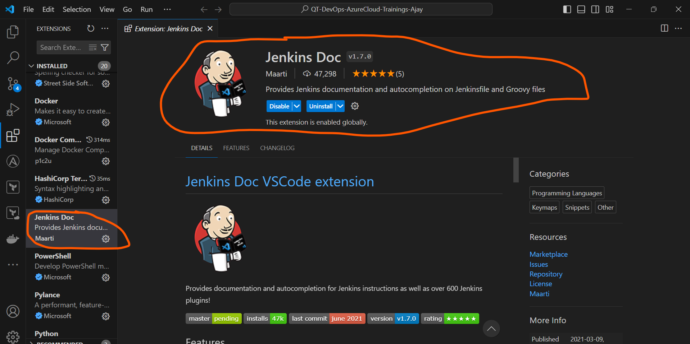


  
